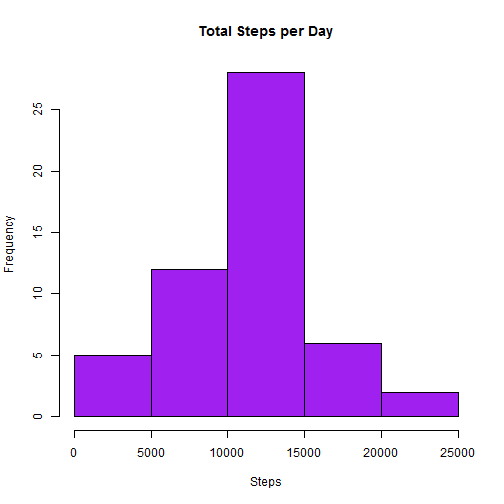
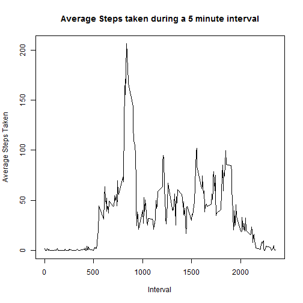
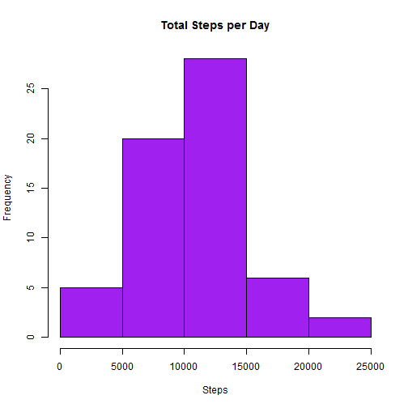
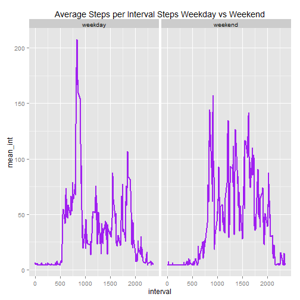

**Loading and Processing the Data**

1. Load the Data 

```r
activity<-read.csv("activity.csv")
```

2. Transform the data as needed
  + Updating Date to Date format 
  + Removing NAs
  + Placing in tbl format to use dpylr 

```r
activity$date<-as.Date(activity$date)
activity<-na.omit(activity)
library(dplyr)
activity<-tbl_df(activity)
```

**What is mean total number of steps taken per day?**

1. Calculate the total number of steps taken per day

```r
daily_steps <- activity %>%
                group_by(date) %>%
                summarize(total_steps=sum(steps))
```

2. Make a histogram of Steps per Day

```r
hist(daily_steps$total_steps, main="Total Steps per Day", xlab="Steps",col="purple")
```

 

3. Calculate and report the mean and median of the total number of steps taken per day

```r
step_stats <- daily_steps %>%
                summarize(mean_steps=mean(total_steps),median_steps=median(total_steps))
```

- The Mean number of steps taken per day is equal to 1.0766189 &times; 10<sup>4</sup>  
- The Median number of steps taken per day is equal to 10765  
  
**What is the average daily activity pattern?**

1.Make a time series plot (i.e. type = "l") of the 5-minute interval (x-axis) and the average number of steps taken, averaged across all days (y-axis)
  + First Summarize   
  + Then Plot   

```r
interval<- activity %>%
            group_by(interval) %>%
            summarize(mean_steps=mean(steps))

plot(interval$interval,interval$mean_steps,type="l",xlab="Interval",ylab = "Average Steps Taken",
     main="Average Steps taken during a 5 minute interval")
```

 

2.Which 5-minute interval, on average across all the days in the dataset, contains the maximum number of steps?

```r
max_int<-interval$interval[which.max(interval$mean_steps)]
```
- The Maximum average steps took place during interval 835
  
**Imputing missing values**  
1.Calculate and report the total number of missing values in the dataset (i.e. the total number of rows with NAs)  
  + Since I originally removed the missings, I am reading back in the data  
  + Then using summary to see which variables have missing values  

```r
activity2<-read.csv("activity.csv")
activity2$date<-as.Date(activity2$date)
summary(activity2)
```

```
##      steps             date               interval     
##  Min.   :  0.00   Min.   :2012-10-01   Min.   :   0.0  
##  1st Qu.:  0.00   1st Qu.:2012-10-16   1st Qu.: 588.8  
##  Median :  0.00   Median :2012-10-31   Median :1177.5  
##  Mean   : 37.38   Mean   :2012-10-31   Mean   :1177.5  
##  3rd Qu.: 12.00   3rd Qu.:2012-11-15   3rd Qu.:1766.2  
##  Max.   :806.00   Max.   :2012-11-30   Max.   :2355.0  
##  NA's   :2304
```
- Since Steps is the only variable with missing values, that is the only variable I need to count for missings 
    

```r
missings<-sum(is.na(activity2$steps))
```
- The total number of missing values is 2304

2.Devise a strategy for filling in all of the missing values in the dataset. The strategy does not need to be sophisticated. For example, you could use the mean/median for that day, or the mean for that 5-minute interval, etc.  
  + I am going to fill in the median number of average steps per interval step  
  + Average number of steps per interval is saved in interval already, just need to find median   
  
3.Create a new dataset that is equal to the original dataset but with the missing data filled in.  

```r
int_med<- interval %>%
          summarize(med=median(mean_steps))

for (i in 1:nrow(activity2)) {
    if (is.na(activity2$steps[i])) {
        activity2$steps[i] <- int_med$med
    }
}
summary(activity2)
```

```
##      steps             date               interval     
##  Min.   :  0.00   Min.   :2012-10-01   Min.   :   0.0  
##  1st Qu.:  0.00   1st Qu.:2012-10-16   1st Qu.: 588.8  
##  Median :  0.00   Median :2012-10-31   Median :1177.5  
##  Mean   : 36.95   Mean   :2012-10-31   Mean   :1177.5  
##  3rd Qu.: 34.11   3rd Qu.:2012-11-15   3rd Qu.:1766.2  
##  Max.   :806.00   Max.   :2012-11-30   Max.   :2355.0
```
- There are no longer any missings   

4.Make a histogram of the total number of steps taken each day and Calculate and report the mean and median total number of steps taken per day.  
  + First I will need to get total steps per day, then I can plot the histogram  

```r
new_sum<- activity2 %>% 
          group_by(date)%>%
          summarize(total_steps=sum(steps))
hist(new_sum$total_steps, main="Total Steps per Day", xlab="Steps",col="purple")
```

 

- Mean and Median Steps   

```r
new_stats<- new_sum %>%
            summarize(mean_steps=mean(total_steps),med_steps=mean(total_steps))
```

- These values are different:  
    - Mean  
        - Old 1.0766189 &times; 10<sup>4</sup>  
        - New 1.0642702 &times; 10<sup>4</sup>  
    - Median  
        - Old 10765  
        - New 1.0642702 &times; 10<sup>4</sup>
- The impact is mean average and median steps 

**Are there differences in activity patterns between weekdays and weekends?**
1.Create a new factor variable in the dataset with two levels - "weekday" and "weekend" indicating whether a given date is a weekday or weekend day.
  + Figure out Day of week with weekdays()
  + Assign daytype orginally to weekday
  + change Day Type on Sat/Sun

```r
activity2$day<-as.factor(weekdays(activity2$date))
activity2$daytype<-"weekday"
activity2$daytype[activity2$day %in% c("Saturday", "Sunday")] <- "weekend"
activity2$daytype<-as.factor(activity2$daytype)
```

2.Make a panel plot containing a time series plot (i.e. type = "l") of the 5-minute interval (x-axis) and the average number of steps taken, averaged across all weekday days or weekend days (y-axis). 


```r
activity3 <- activity2 %>%
            group_by(daytype,interval) %>%
            summarize(mean_int=mean(steps))
library(ggplot2)
ggplot(activity3, aes(interval,mean_int)) +
                 ggtitle("Average Steps per Interval Steps Weekday vs Weekend") +
                 facet_grid(. ~ daytype) +
                 geom_line(size = 1, color="purple")
```

 
    

    
